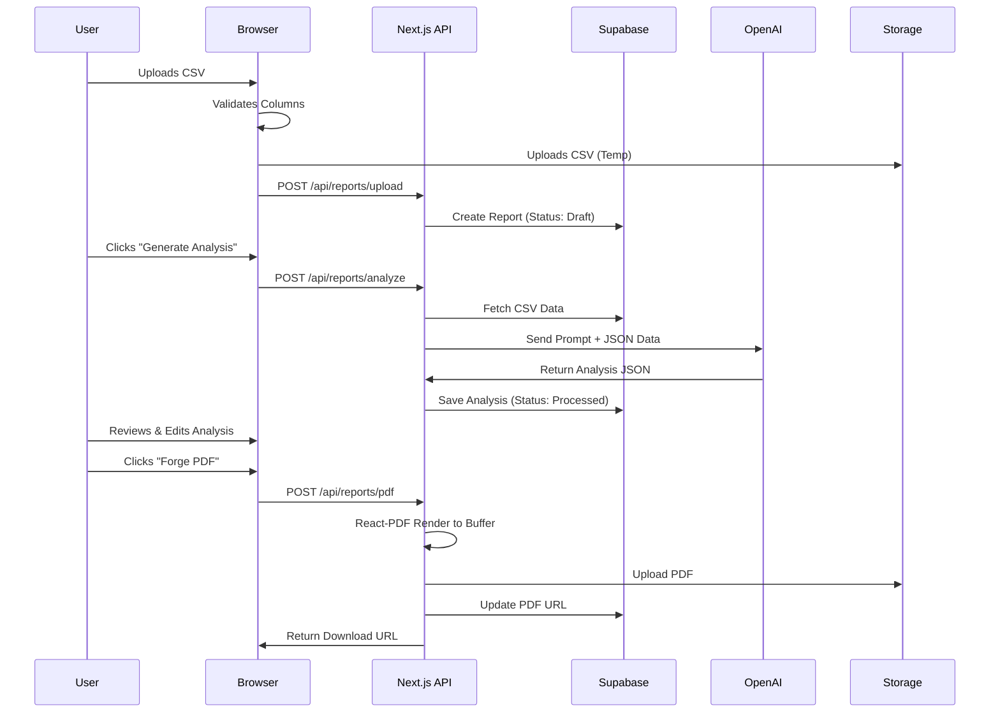

# System Architecture

## 18. HIGH-LEVEL ARCHITECTURE

**ReportForge** employs a **Serverless, Event-Driven Architecture** built on the Modern Data Stack. This ensures high scalability, low maintenance, and cost-effectiveness for the MVP.

### Tech Stack / BOM (Bill of Materials)

| Component | Technology | Reasoning |
| :--- | :--- | :--- |
| **Frontend Framework** | **Next.js 14 (App Router)** | Industry standard, server components, easy Vercel deploy. |
| **Language** | **TypeScript** | Type safety is critical for data processing apps. |
| **Styling** | **Tailwind CSS** | Fast development, consistent design system. |
| **UI Library** | **Shadcn/UI** | Beautiful, accessible, copy-paste components. |
| **Database** | **Supabase (PostgreSQL)** | Best-in-class generic backend, robust Auth, RLS security. |
| **Authentication** | **Supabase Auth** | secure, handles sessions/password resets out of the box. |
| **File Storage** | **Supabase Storage** | S3-compatible, integrated with DB permissions. |
| **AI LLM** | **OpenAI GPT-4o-mini** | Best balance of speed, cost, and analytical reasoning. |
| **PDF Engine** | **@react-pdf/renderer** | React-based PDF generation, runs on server/edge. |
| **Payments** | **Stripe Checkout** | Trusted, handles all PCI compliance. |
| **Deployment** | **Vercel** | Native Next.js support, edge scaling. |

### Data Flow Diagrams

#### 1. Report Generation Pipeline


---

## 19. DATABASE SCHEMA

The database is **PostgreSQL** hosted on Supabase. We use strictly typed schemas and enforcing **Row Level Security (RLS)**.

### Entity Relationship Diagram (ERD)

```text
agencies (User/Tenant)
├── id: uuid (PK)
├── email: varchar
├── name: varchar
├── branding: jsonb { usage, logo_url, color }
├── subscription_status: varchar
├── created_at: timestamp
└── (One-to-Many) ──< clients

clients
├── id: uuid (PK)
├── agency_id: uuid (FK)
├── name: varchar
├── notes: text
├── created_at: timestamp
└── (One-to-Many) ──< reports

reports
├── id: uuid (PK)
├── client_id: uuid (FK)
├── agency_id: uuid (FK)
├── status: enum (draft, processing, completed, failed)
├── metadata: jsonb { date_range, campaign_count, total_spend }
├── csv_path: text (Storage path)
├── ai_analysis: jsonb { summary, wins[], concerns[], recs[] }
├── pdf_url: text
└── created_at: timestamp
```

### Table Definitions

**1. `agencies`**
*   Master record for the signed-up user.
*   One record per unique email.
*   `stripe_customer_id`: Links to Stripe.

**2. `clients`**
*   Simple organization bucket for reports.
*   `agency_id` is critical for RLS.

**3. `reports`**
*   The core transactional entity.
*   `ai_analysis` stores the JSON blob returned by OpenAI.
*   `csv_path`: We store the raw CSV for auditing/re-processing.
*   `agency_id` is duplicated here to simplify RLS policies (avoiding joins on permission checks).

### RLS Policies (Security)
*   **Rule 1:** Users can only `SELECT`, `INSERT`, `UPDATE`, `DELETE` rows where `agency_id` == `auth.uid()`.
*   **Rule 2:** `clients` and `reports` tables must always check `agency_id`.

---

## 20. API ARCHITECTURE

We use **Next.js Server Actions** and **Route Handlers** (`app/api/...`).

### Endpoint Structure
See `docs/05-API-SPECIFICATIONS.md` for full contract.

*   `/api/reports/upload`: Handle file parsing and validation.
*   `/api/reports/[id]/analyze`: Trigger the AI analysis job.
*   `/api/reports/[id]/pdf`: Render and save the PDF.

### Authentication Middleware
*   All API routes (except webhooks) must verify the Supabase Session.
*   If no session: Return `401 Unauthorized`.

---

## 22. INFRASTRUCTURE & DEPLOYMENT

### Hosting Architecture
*   **Vercel:** Hosts the Next.js application, API routes, and edge functions.
*   **Supabase:** Hosts the PostgreSQL database, Auth service, and Storage buckets.

### Deployment Pipeline (CI/CD)
1.  **Push to `main` branch** on GitHub.
2.  **Vercel** detects change.
3.  **Build:** `npm run build` (Type checking + Linting).
4.  **Deploy:** Preview URL generated (for PRs) or Production Deploy (for main).
5.  **Migrations:** Supabase migrations applied manually or via CI (post-MVP).

### Environment Variables
*   `NEXT_PUBLIC_SUPABASE_URL`: Public API URL.
*   `NEXT_PUBLIC_SUPABASE_ANON_KEY`: Safe for browser usage.
*   `SUPABASE_SERVICE_ROLE_KEY`: **SECRET** (Server only, bypasses RLS).
*   `OPENAI_API_KEY`: **SECRET**.
*   `STRIPE_SECRET_KEY`: **SECRET**.

---

## 23. SECURITY ARCHITECTURE

### Layers of Defense
1.  **Identity:** Supabase Auth handles secure password hashing and JWT issuance.
2.  **Access Control:** RLS (Row Level Security) ensures strict data isolation at the database engine level. Even if the API is leaky, the DB rejects unauthorized queries.
3.  **Input Validation:** Zod schemas validate every API input (CSV structure, JSON payloads).
4.  **Storage Security:** Storage buckets are private. Files are accessed via signed URLs valid for 1 hour.
5.  **Payment Security:** ReportForge never touches credit card numbers. All sensitive data is handled by Stripe's iframe/hosted page.

### Compliance
*   **GDPR:** We need to offer a "Delete Account" button that cascades deletes (Clients -> Reports -> Storage).
*   **Data Retention:** We do not retain raw user data for training our models.
